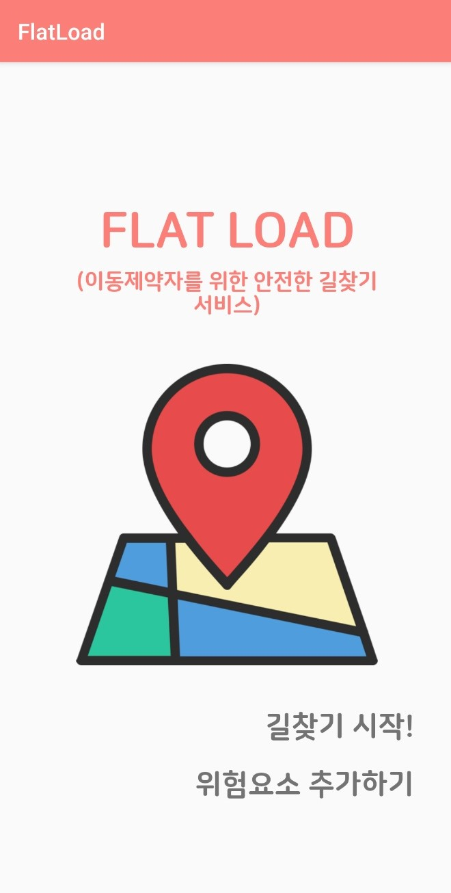
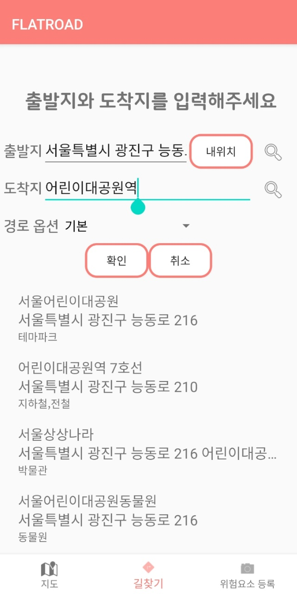
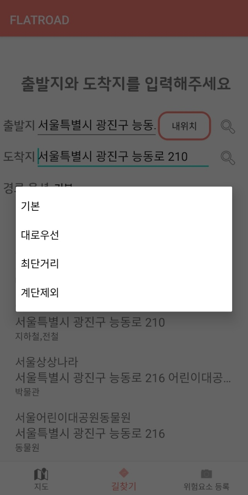
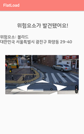
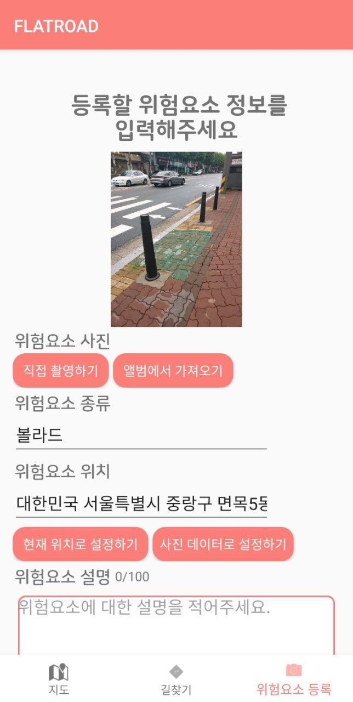
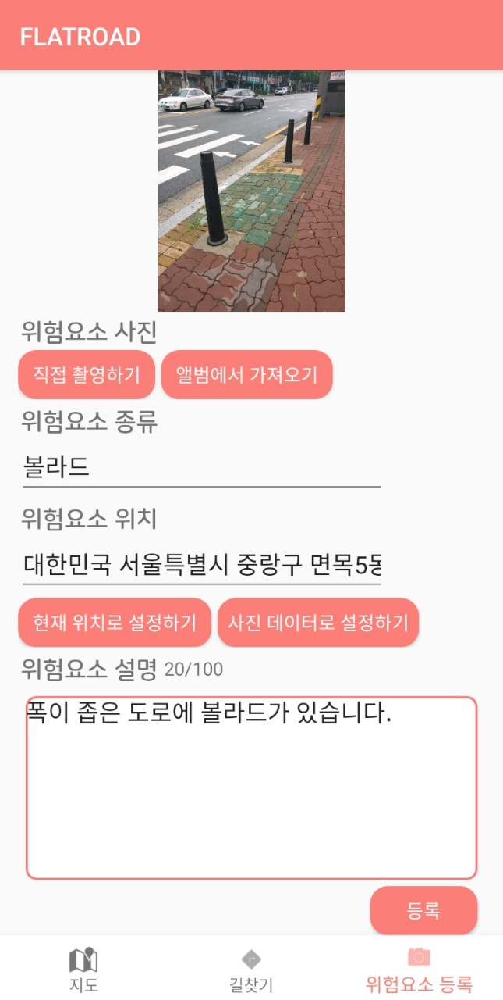

# 🍀FlatRoad🍀 : 이동제약자를 위한 안전한 길찾기 서비스

 

## 🤗😀😊Members
Konkuk University  smartICTconvergence 
팀장 : 박가은 
팀원 : 안예림, 서민영, 고유나 

## 🔎프로젝트 소개
 보행로에는 다양한 장애물들이 존재한다. 보도의 턱, 신호등, 가로수, 볼라드 등 보도를 구성하는 것뿐만아니라 주차된 차들, 자전거 등 예상할 수 없는 장애물들도 있다. 휠체어, 목발을 이용하거나 거동이 힘든 사람이라면 보행로에 존재하는 작은 장애물이라도 이동하는 데 불편함을 느낄 수 있다. 우리는 사용자가 보행로 위에 존재하는 장애물을 미리 파악하고 자신의 상황에 맞게 대처할 수 있도록 보행로의 위험요소를 알려주는 길찾기 서비스를 기획하였다. 
* 안드로이드 어플리케이션으로 제공되며 출발지부터 목적지까지의 경로를 안내하고 해당 경로내에 존재하는 위험요소의 위치와 종류를 알려준다.

## 개발환경💻
- 앱 : Android / Kotlin
- 서버 : NodeJS / JavaScript
- 객체 탐지 모델 : YOLOv5 / python

## 주요 기능🔧
### 1. 길찾기 서비스 
> 사용자는 출발지부터 목적지까지의 경로와 그 경로에서의 위험요소 정보를 받을 수 있다 
사용자가 길찾기 서비스를 받기 위한 출발지와 도착지를 입력해야한다. 이때 내위치 버튼을 클릭하면 사용자의 현 위치를 주소로 변환해준다. 확인 버튼을 클릭하면 사용자가 입력한 출발지와 도착지에 따른 경로를 polyline으로 표시한 지도 화면이 나타난다. 이때 해당경로에서 인식된 볼라드의 위치를 마커로 표현해준다. 마커를 클릭하면 로드뷰 화면으로 이동하고, 해당 좌표의 로드뷰 사진과 위험요소 이름을 사용자에게 알려준다. 현재 위험요소는 볼라드만을 탐지하여 알려준다.

 
 
 

### 2. 위험요소 추가 기능 
> 사용자는 특정 장소의 이미지를 찍어 보행로 정보를 추가할 수 있다. 사용자는 위험요소가 존재하는 인도의 사진을 찍어 등록할 수 있다. 사용자가 등록한 정보와 이미지는 길찾기 서비스에 추가로 제공된다.  
 사용자가 위험요소를 직접 촬영하거나 스마트폰의 앨범에서 위험요소 사진을 선택하여 업로드 한다. 종류는 직접 입력하고 위치는 ‘현재 위치로 설정하기’나 ‘사진 데이터로 입력하기’ 버튼을 클릭하여 입력한다. 위험요소 데이터를 입력 받고 등록 버튼을 클릭한다. 

 
 

## ✨기대효과✨
1. 사용자의 안전성과 효율성 증가
> 사용자는 자신의 경로에서 위험요소를 미리 알고 대비할 수 있다. 위험요소가 자신이 갈 경로 위에 띄워지게 되어 위험요소가 어디에 있는지 확인할 수 있다. 또, 위험요소가 있는 도보의 실제 사진을 볼 수도 있다. 사용자는 이런 정보를 바탕으로 자신이 그 도보를 이용할 수 있는지 쉽게 판단할 수 있다. 이런 정보는 사용자가 도보를 더 안전하게 사용할 수 있도록 하고 헛걸음하지 않도록 해주어 사용자의 시간을 줄여줄 수 있다.
 
2. 사용자의 자신감 증가
> 이동제약자는 다양한 도보의 상태에 따라 이동이 어려울 수 있고 돌발 상황이 일어났을 때 대처하기 어려울 수 있다. FlatRoad는 도보에 대한 정보를 미리 숙지할 수 있어 사용자가 도보에 대해 미리 대비를 할 수 있게 해준다. 이는 사용자가 혼자서도 길을 잘 찾아갈 수 있게 하여 외출에 자신감을 가질 수 있도록 할 수 있다. 또한, 처음 찾아가는 길에 대한 정보를 미리 알 수 있어 사용자가 혼자서도 익숙하지 않을 길을 갈 수 있게 해준다. 사용자가 모르는 길을 가는 것에 대해 두려워하지 않고 자신감을 가지고 출발할 수 있게 해준다.

## 향후 개발계획📚
 앞으로 위험요소 종류를 추가하고 객체 탐지 모델 성능을 향상시켜 정확하게 위험요소를 탐지해낼 수 있도록 할 것이다. 위험요소 추가 등록 기능과 더불어 커뮤니티 기능을 추가하여, 사용자 간의 맞춤형 정보공유를 유도하고 자체적인 네트워크를 형성하여 더 편리하게 정보를 얻을 수 있는 소통의 공간으로 발전해 나갈 예정이다. 또한, 도보길찾기 외에 대중교통안내나 건물 안내 등 다양한 길찾기 기능 및 안내기능을 추가하여 이동제약자를 위한 복합적인 길안내 서비스를 제공해 나갈 수 있을 것이다.

## 시연영상
