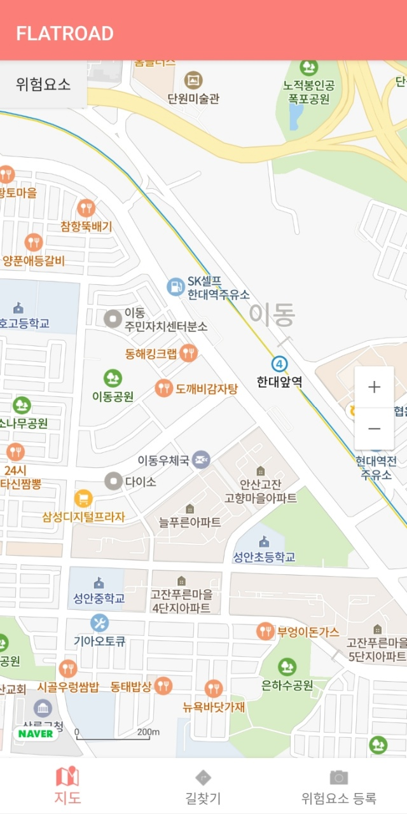
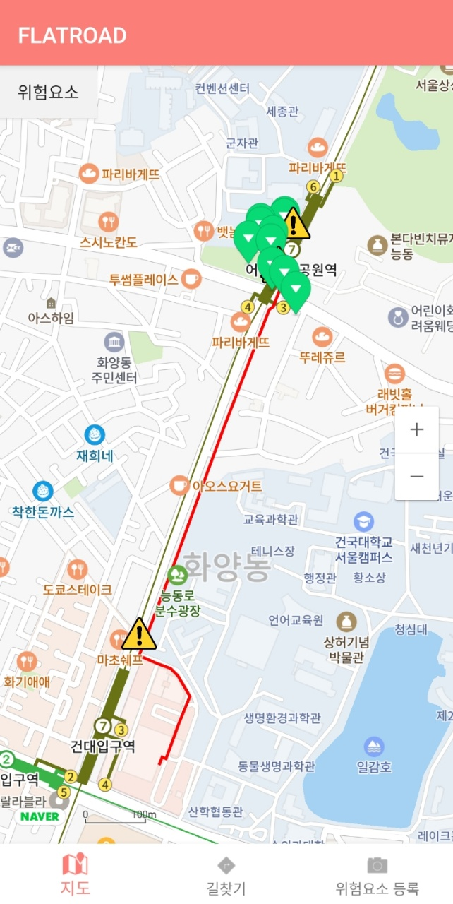
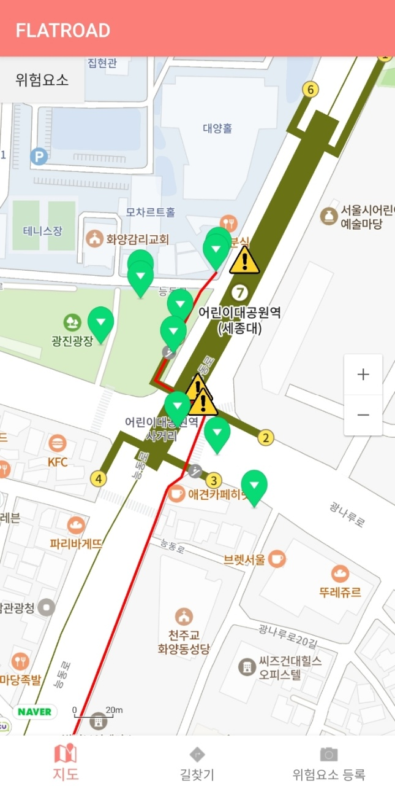
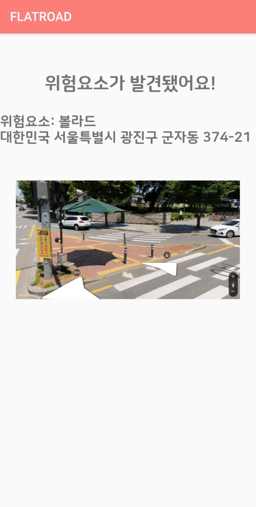
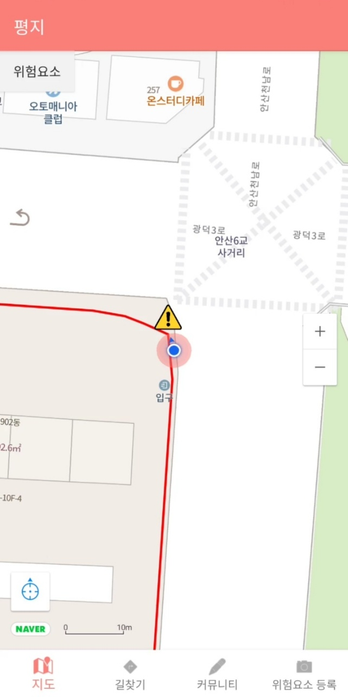

## 목차 
- [프로젝트 설명](#프로젝트-설명) 
- [설계](#설계)
- [트러블슈팅](#트러블슈팅)
- [협업](#협업)
- [성과](#성과)
- [시연 영상](#시연-영상)
- [팀원](#팀원)
- [라이선스](#라이선스)

## 프로젝트 설명

### 🍀FlatRoad🍀 : 이동제약자를 위한 안전한 길찾기 서비스

### 🔎프로젝트 소개
> 보행로에는 다양한 장애물들이 존재합니다. 보도의 턱, 신호등, 가로수, 볼라드 등 보도를 구성하는 것뿐만아니라 주차된 차들, 자전거 등 예상할 수 없는 장애물들도 있습니다. 휠체어, 목발을 이용하거나 거동이 힘든 사람이라면 보행로에 존재하는 작은 장애물이라도 이동하는 데 불편함을 느낄 수 있습니다. 저희는 사용자가 보행로 위에 존재하는 장애물을 미리 파악하고 자신의 상황에 맞게 대처할 수 있도록 보행로의 위험요소를 알려주는 길찾기 서비스를 기획하였습니다. 

### 개발환경💻
- 앱 : Android / Kotlin
- 서버 : NodeJS / JavaScript
- 객체 탐지 모델 : YOLOv5 / python
- 데이터베이스 : MySQL

### 주요 기능🔧
1. 지도 서비스
   - 사용자는 지도를 통해 본 프로젝트의 주요 기능을 이용 할 수 있습니다.
     - 지도 상단에 위험요소 버튼을 클릭하면 화면 내의 위험요소 정보가 띄워집니다.
     - 길찾기 기능 사용시 경로와 위험요소 위치가 지도에 표시됩니다.

 

2. 길찾기 서비스
   - 본 프로젝트의 주요 기능으로 보행 경로와 경로 주변의 위험요소 정보를 알려줍니다.
     - 앱에서 장소를 검색하여 출발지와 목적지를 찾고 대로우선, 최단거리, 계단제외 중에서 경로를 선택하여 서버로 전송합니다.
     - 확인 버튼 클릭시 사용자가 입력한 출발지와 도착지에 따른 경로를 polyline으로 표시한 지도 화면이 나타납니다.
     - 경로에서 인식된 볼라드의 위치는 느낌표 모양의 마커로 표시하고 경로 주변의 위험요소 정보의 위치는 초록색 마커로 표시됩니다.
     - 각각의 마커를 클릭하면 로드뷰 화면과 위험요소 정보 화면으로 이동하고 해당 좌표의 로드뷰 사진과 위험요소 이름을 사용자에게 알려줍니다.
 

 
 
 
 
 
 

         
3. 음성 인식
   - 터치가 불편한 사용자가 편리하게 길찾기 기능을 이용할 수 있도록 추가한 [서비스 기능](https://www.youtube.com/watch?v=4uiJk_1d-B0)입니다.
     - 길찾기를 위해 필요한 출발지, 도착지, 경로 옵션을 음성으로 입력해 서버로 전송합니다.
     - 경로를 전송 받고 위치 트래킹이 켜진 상태에서 위험요소와 3m 이내로 가까워지면 음성으로 직선거리를 알려줍니다. 

 
 
 
 

4. 위험요소 추가 기능
   - 사용자가 특정 장소의 사진을 찍어 보행로 정보를 추가하는 기능입니다.
   - 사용자가 등록한 정보와 이미지는 길찾기 서비스에 추가로 제공됩니다.

### 위험요소 데이터
1. 로드뷰 이미지에서 위험요소 객체 탐지
   - Kakao roadview api로 경로 좌표의 로드뷰를 불러오고 grabzit api로 로드뷰 화면을 캡처합니다.
   - 객체탐지모델인 yolov5를 이용하여 위험요소를 탐지합니다.
   - 현재 탐지 모델은 볼라드만 위험요소로 탐지하여 알려줍니다.

2. 공공 데이터와 앱을 이용한 데이터 수집
   - 공공데이터를 이용하여 7020개의 위험요소 정보를 수집하였습니다.
   - 위험요소 추가 기능을 이용해 사용자로부터 위험요소 정보를 얻습니다.

## 설계
- 시스템 설계도 입니다.

## 트러블슈팅
- 프로젝트를 진행하며 가장 고민한 2가지 입니다.
  - [ ] #1 로드뷰의 각도를 조절하기 위한 노력
  > Roadview API에서 로드뷰 방향 정보를 제공하지 않아 로드뷰 방향을 조절할 수 없는 문제가 발생하여 이를 해결하기 위해 노력했습니다.
  - [ ] #2 음성 인식 기능을 구현하기 위한 고민
  > Kakao Speech API가 제공하는 기능을 활용해 앱에서 사용할 수 있는 음성 대화를 구현하기 위해 고민했습니다.
    
## 협업

 

- 구글 드라이브와 미팅으로 매주 회의를 진행하며 협업하였습니다.

## 성과

 
 

- 약 8개월 동안 본 프로젝트를 통해 달성한 성과 입니다.
  - 건국대학교 SW중심대학사업단에서 주최하는 SW경진대회에서 장려상을 수상하였습니다.
  - 공개SW개발자대회 [사회문제형 사회적약자 부문](https://www.sosslab.kr/social_problem/%EB%B3%B4%EB%8F%84-%EC%9C%84-%EC%9C%84%ED%97%98%EC%9A%94%EC%86%8C%EB%A5%BC-%ED%83%90%EC%A7%80%ED%95%98%EC%97%AC-%EC%95%8C%EB%A0%A4%EC%A3%BC%EB%8A%94-%EA%B8%B8%EC%B0%BE%EA%B8%B0-%EC%84%9C%EB%B9%84%EC%8A%A4?category_item_id=13&progressCategory_item_id=16)에 출품해 전체 462개 참가 팀 중 본선 진출 50팀에 선정되어 [우수작 정보집](http://bypub.kr/ebook/oss2021-1/index.html#p=57)에 기록되었습니다.

## 시연 영상
- 모든 기능 시연이 담긴 [영상](https://www.youtube.com/watch?v=tuVqONCSgxg) 으로 약 5분 정도 소요됩니다.
  
## 팀원
> Konkuk University  smartICTconvergence 
> 팀장 : 박가은 
> 팀원 : 안예림, 서민영, 고유나 

## 라이선스
- 앱은 Apache-2.0 License 서버는 GPL-3.0 License를 사용합니다. 자세한 사항은 [LICENSE](https://github.com/gaeunpark924/ComprehensiveDesign2/blob/main/LICENSE)를 따릅니다.

